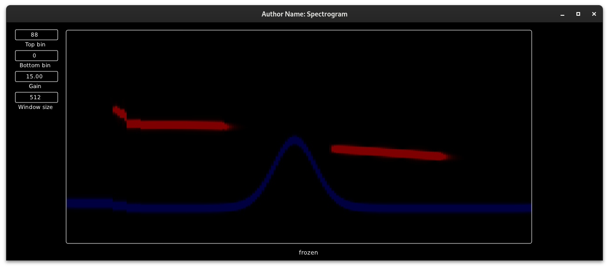

# Maybe a sonogram?

- Left click to freeze view
- Dumps the view to a *huge* CSV file upon freezing*
- Right click to place an horizontal cursor
- Drag vertically on the number boxes to adjust, ctrl + drag for finer adjustments, scrollwheel works too

Debian Testing/Unstable x64 build [here](https://point.pointorg.org/s/9bLRwX5p7dGoftY)



To build locally, update `CMakeLists.txt` to point to a clone of DPF on `develop` branch

```shell
cmake -Bbuild
cmake --build build -v -j16
pw-jack ./build/bin/Spectrogram
```

Or start Carla then drag and drop `./build/bin/Spectrogram-vst2.so`

 \* Dump is ~9MB and looks like that:
 ```
 0270_left_mag,31.306980,74.390343,...
0270_left_phase,0.000000,2.933716,...
0270_right_mag,25.216019,84.440460,...
0270_right_phase,0.000000,2.100785,...
```


