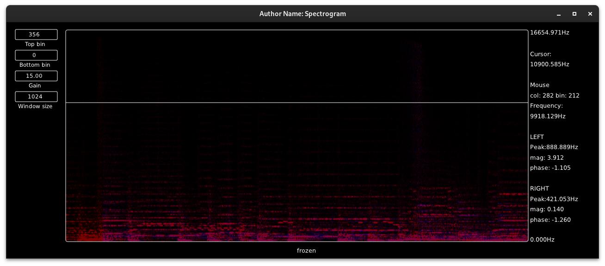

# Maybe a sonogram?

> ⚠️ WIP

Debian Testing/Unstable x64 build [here](https://point.pointorg.org/s/9bLRwX5p7dGoftY)

To build locally, update `CMakeLists.txt` to point to a clone of DPF on `develop` branch

```shell
cmake -Bbuild
cmake --build build -v -j16
pw-jack ./build/bin/Spectrogram
```

Or start Carla then drag and drop `./build/bin/Spectrogram-vst2.so`


